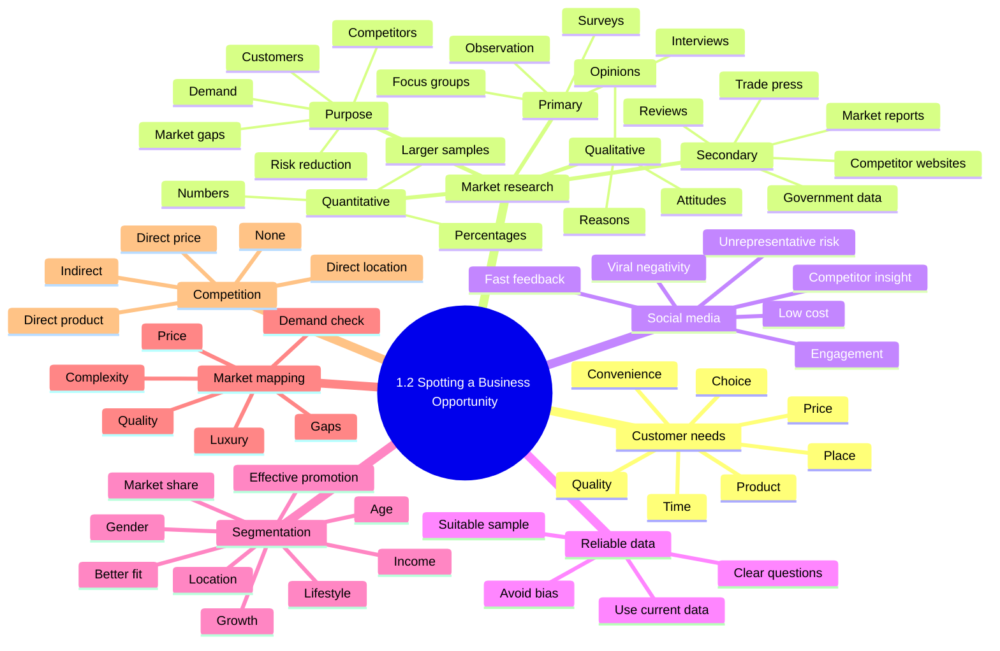

# 1.2 Spotting a Business Opportunity Mind Map

```mermaid
mindmap
  root((1.2 Spotting a Business Opportunity))
    Customer needs
      Product
      Quality
      Price
      Time
      Place
      Choice
      Convenience
    Market research
      Purpose
        Customers
        Demand
        Competitors
        Market gaps
        Risk reduction
      Primary
        Observation
        Surveys
        Interviews
        Focus groups
      Secondary
        Government data
        Competitor websites
        Reviews
        Trade press
        Market reports
      Qualitative
        Opinions
        Attitudes
        Reasons
      Quantitative
        Numbers
        Percentages
        Larger samples
    Social media
      Fast feedback
      Low cost
      Competitor insight
      Engagement
      Unrepresentative risk
      Viral negativity
    Reliable data
      Avoid bias
      Use current data
      Clear questions
      Suitable sample
    Segmentation
      Better fit
      Growth
      Effective promotion
      Market share
      Gender
      Age
      Location
      Income
      Lifestyle
    Market mapping
      Price
      Quality
      Luxury
      Complexity
      Gaps
      Demand check
    Competition
      Direct product
      Direct price
      Direct location
      Indirect
      None
```
