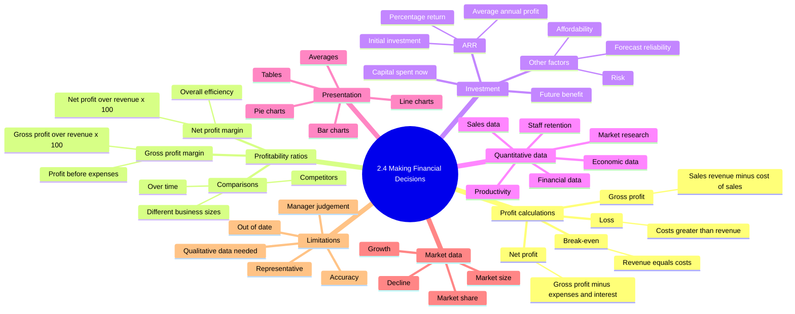

# 2.4 Making Financial Decisions Mind Map

```mermaid
mindmap
  root((2.4 Making Financial Decisions))
    Profit calculations
      Gross profit
        Sales revenue minus cost of sales
      Net profit
        Gross profit minus expenses and interest
      Loss
        Costs greater than revenue
      Break-even
        Revenue equals costs
    Profitability ratios
      Gross profit margin
        Gross profit over revenue x 100
        Profit before expenses
      Net profit margin
        Net profit over revenue x 100
        Overall efficiency
      Comparisons
        Over time
        Competitors
        Different business sizes
    Investment
      Capital spent now
      Future benefit
      ARR
        Average annual profit
        Initial investment
        Percentage return
      Other factors
        Risk
        Affordability
        Forecast reliability
    Quantitative data
      Financial data
      Market research
      Sales data
      Productivity
      Staff retention
      Economic data
    Presentation
      Tables
      Bar charts
      Pie charts
      Line charts
      Averages
    Market data
      Market size
      Market share
      Growth
      Decline
    Limitations
      Accuracy
      Representative
      Out of date
      Qualitative data needed
      Manager judgement
```
